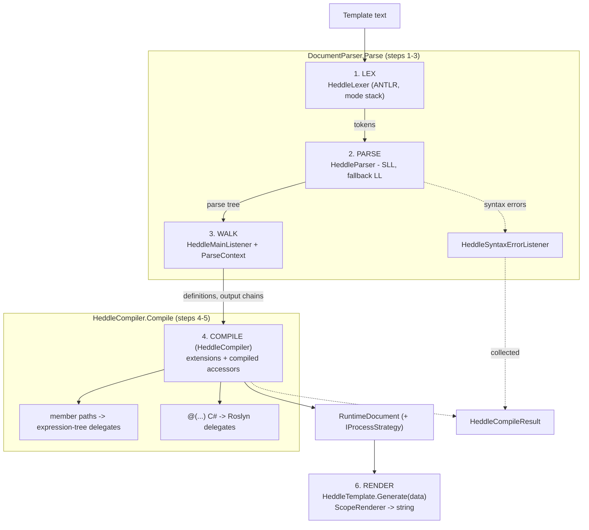
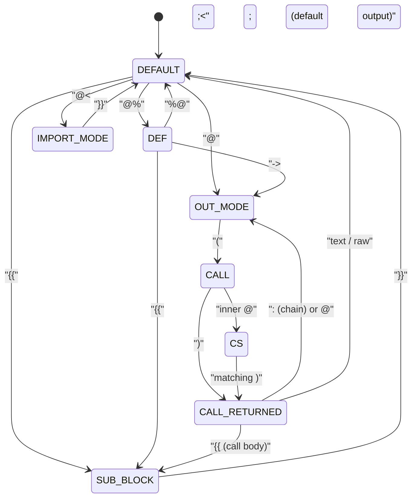

# Architecture

This page is for contributors who want to understand or modify the engine. It traces a
template from text to rendered output and points at the types that do each job.

## High‑level pipeline



The orchestration entry points are
[`DocumentParser.Parse`](../src/Heddle/Language/DocumentParser.cs) (steps 1–3) and
[`HeddleTemplate.Compile`](../src/Heddle/HeddleTemplate.cs) → `HeddleCompiler.Compile` (steps 4–5).

---

## 1. Lexing

The lexer is generated from [HeddleLexer.g4](../src/Heddle.Language/HeddleLexer.g4) (which
imports [CSharp.g4](../src/Heddle.Language/CSharp.g4) for C# tokens). It is **mode‑based**:
a stack of lexer modes makes the language context‑sensitive so that the same characters mean
different things in different places (e.g. `}}` ends a subtemplate but is plain text at the
top level).

Modes (entered/exited via `pushMode`/`popMode`/`mode`):

| Mode | Entered by | Purpose |
| --- | --- | --- |
| *(default)* | — | Top‑level text + directive starts (`@%`, `@<<`, `@`, raw). |
| `SUB_BLOCK` | `{{` | Subtemplate body; `}}` pops. |
| `DEF` | `@%` | Definition block: `<name>`, `:` base, `::` type, `->` default, `%@` pops. |
| `IMPORT_MODE` | `@<<` | Import path between `{{ }}`. |
| `OUT_MODE` | `@` | Extension name; `(` opens parameter. |
| `CALL` | `(` | Parameter tokens (ids, `.`, `::`, `:`), nested `(`; inner `@` → `CS`. |
| `CALL_RETURNED` | `)` | What follows a call: `:` chain, `@` next, `{{` body, raw, etc. |
| `CS` | inner `@` in a parameter | Embedded C# expression; balances `(`/`)`, ends at matching `)`. |

The mode transitions (solid = push, dashed = pop/return to a mode):



Comments (`@* … *@`), trimmed whitespace (`@\`), and definition whitespace are routed to the
**hidden channel** so they never reach the parser but are still available for tooling (the
listener collects hidden‑channel positions as `SkippedTokens`). This is why comments can
appear mid‑token. See the
[Language Reference → lexer modes](language-reference.md#how-the-lexer-reads-a-template-modes)
for the author‑facing view.

---

## 2. Parsing

The parser is generated from [HeddleParser.g4](../src/Heddle.Language/HeddleParser.g4). The
top‑level rule is `heddle`; the interesting rules are `definition`, `outblock`, `chain`, `call`,
`member_expression`, `csharp_expression`, and `subtemplate`.

[`DocumentParser`](../src/Heddle/Language/DocumentParser.cs) controls prediction strategy:

- It first parses in **SLL** mode (fast). If SLL throws `ParseCanceledException` (ambiguity),
  or if errors were reported, it **falls back** to `LL_EXACT_AMBIG_DETECTION` (full LL) via
  `ParseDiagnosticMode`, and records a `HeddleCompileWarning` noting the SLL failure.
- When `TemplateOptions.ProvideLanguageFeatures` is set (editor/tooling mode), it parses
  directly in LL mode and produces a token list for syntax highlighting instead of optimizing
  for throughput.

Syntax errors are gathered by
[`HeddleSyntaxErrorListener`](../src/Heddle/Language/HeddleSyntaxErrorListener.cs) into the
`ParseContext`, then copied onto `CompileContext.CompileErrors`.

---

## 3. Tree walking

A `ParseTreeWalker` drives
[`HeddleMainListener`](../src/Heddle/Language/HeddleMainListener.cs), which builds the
[`ParseContext`](../src/Heddle/Language/ParseContext.cs): the set of **definitions**
(`DefinitionBlock`/`DefinitionItem`), **output chains** (`OutputChain`/`OutputItem`),
imports, and the raw/text spans. This is the structured representation the compiler consumes.

---

## 4–5. Compilation

[`HeddleCompiler`](../src/Heddle/Runtime/HeddleCompiler.cs) turns the parse context into an
**execution‑ready document** ([`RuntimeDocument`](../src/Heddle/Runtime/RuntimeDocument.cs)):
a tree of extension instances, each wired to a **compiled** value accessor. The template itself
is *not* transpiled to C# or to IL — its structure becomes an object graph; only the value
accessors are compiled, and nothing is interpreted or reflected at render time.

- It instantiates the right **extension** for each call (resolved by name from the registered
  set), and calls `InitStart` to thread types through the chain and compile nested
  subtemplates; extensions needing a second pass use `CompleteInit` (e.g.
  [`PartialExtension`](../src/Heddle/Extensions/PartialExtension.cs)).
- **Member paths** (`@(A.B.C)`) compile to **expression‑tree delegates**:
  [`ModelParameter`](../src/Heddle/Runtime/Parameters/ModelParameter.cs) builds an
  `Expression<Func<object,object>>` over the resolved property chain (null‑safe for reference
  types) and `.Compile()`s it. Reflection is used **only here, at compile time**, to locate the
  properties — never at render time.
- **Embedded C# expressions** (`@( … )`) are emitted into C# source via the `.tcs` templates in
  [src/Heddle/LanguageTemplates](../src/Heddle/LanguageTemplates)
  (`CSharpPreparseTemplate.tcs`, `CSharpClassTemplate.tcs`) and compiled by **Roslyn**
  (`Microsoft.CodeAnalysis.CSharp`) into `(model, chained, root)` delegates
  ([`CompiledParameter`](../src/Heddle/Runtime/Parameters/CompiledParameter.cs)). This is
  also where C# expressions are **bound to the model's types**; the
  [`CompileScope`](../src/Heddle/Runtime)/`CSharpContext` track imported namespaces
  (`@using`) and the model type (`@model`, `:: Type`). `CompileScope.Compile()` runs that
  Roslyn pass.
- Errors from either path are collected as `HeddleCompileError`s rather than thrown, and surfaced
  through [`HeddleCompileResult`](../src/Heddle/Data/HeddleCompileResult.cs).

The result is a `RuntimeDocument` exposing an `IProcessStrategy` (`Strategy`) — the
execution‑ready render tree. So "compiling a template" means **two** kinds of code generation
(expression‑tree delegates for member access, Roslyn delegates for embedded C#) wired into one
document — not a single whole‑template Roslyn compile.

---

## 6. Rendering

[`HeddleTemplate.Generate`](../src/Heddle/HeddleTemplate.cs) creates a
[`ScopeRenderer`](../src/Heddle/Data) and a root [`Scope`](../src/Heddle/Data/Scope.cs),
then invokes `_processStrategy.Render(scope)`. Extensions write through
`scope.Renderer.Render(...)` (the streaming path, `RenderData`) or return strings
(`ProcessData`) when a parent needs the value (e.g. inside a chain). The renderer's buffer is
size‑adaptive across calls (a per‑instance high‑water mark with ~10 % margin; the field is
length‑based on net8+ and count‑based on older targets).

`Scope` is a small readonly struct carrying `ModelData`, `ChainedData`, `ParentModelData`,
`CallerData`, `RootData`, and the `Renderer`; its pure transforms (`Model`, `Parent`, `Chain`,
…) construct the child scopes extensions hand to their subtemplates. See
[Writing Custom Extensions](custom-extensions.md) for the author‑facing contract.

---

## Performance characteristics

The repository's [BenchmarkDotNet suite](../src/Heddle.Performance) measures Heddle against four
other .NET template engines (Fluid, Scriban, DotLiquid, Handlebars.Net) — all four rendering
byte‑identical parity‑checked output over a component‑heavy composition workload — plus ASP.NET Core
Razor, which renders a larger, different page and is **not** under the parity assertion
(`[MemoryDiagnoser]` enabled). In the run of **2026‑07‑11** (commit `8341bb67`; AMD Ryzen 9 9950X,
.NET 10.0.9, BenchmarkDotNet 0.15.8) Heddle rendered that page in **32.50 μs / 227.86 KB** — the
fastest of the six and least‑or‑tied on allocation; the next engine (Fluid) took 2.0× as long and
Scriban 11.7× with 5.07× the allocation. The full render and compile‑cost tables, environment
header, and raw artifacts live in the [README Performance section](../README.md#performance) and
[docs/benchmarks/2026-07-11](benchmarks/2026-07-11/). The reasons Heddle leads on the render path are
structural, not incidental:

- **Execution‑ready document, not per‑call activation.** Each template becomes a
  `RuntimeDocument` / `IProcessStrategy` with extension instances already resolved and typed,
  and every value accessor pre‑**compiled** (expression‑tree delegates for member paths, Roslyn
  delegates for embedded C#) — no reflection or re‑parsing per render. Rendering a dozen
  components is a dozen direct `RenderData` calls — it does not spin up partials, view
  components, section buffers, or DI scopes per component the way Razor does. The benchmark
  page exercises exactly this: many `@area_component(...)`, `@assets_component(...)`,
  `@head_scripts()`, etc. calls.
- **Streaming, low‑allocation output.** Extensions write directly to a single
  `ScopeRenderer` whose buffer is **size‑adaptive across renders** (a per‑instance high‑water
  mark), so a warmed‑up template stops reallocating its output buffer. `list` pre‑sizes from
  `ICollection<T>.Count` when available.
- **Struct `Scope`, aggressive inlining.** The per‑node data view is a readonly `struct` with
  `[MethodImpl(AggressiveInlining)]` transforms, avoiding per‑scope heap allocation as the
  renderer descends into elements and subtemplates.
- **Composition is free at run time.** Splitting a page into independent reusable templates
  recombined by a layout (see the benchmark's `@<<{{layout.heddle}}` import + `<body:body>`
  override) compiles down to the same flat render document as an inline page. Decoupled
  definitions cost nothing extra to render — unlike Razor sections, whose layout/section
  binding adds indirection. See
  [Language Reference → inheritance](language-reference.md#inheritance-and-override-childbase).

The trade‑off is **up‑front compilation**: the first compile runs ANTLR (parse), expression‑tree
compilation (member accessors), and Roslyn (embedded C#), so it is not cheap — the model is
"compile once, render many." In the same 2026‑07‑11 run, cold‑compiling the layout + home
templates took **264.99 μs / 1,339.67 KB** for Heddle versus single‑digit microseconds for the
Liquid engines (Fluid 3.65 μs, Scriban 4.68 μs, DotLiquid 7.21 μs) — a cost amortized across every
cached render. Compile cost is benchmarked via
[TemplateParseBenchmarks](../src/Heddle.Performance/TemplateParseBenchmarks.cs) and the runners in
[src/Heddle.Performance/Runners](../src/Heddle.Performance/Runners/README.md); full table in the
[README](../README.md#performance).

---

## Source layout (`src/`)

| Path | Contents |
| --- | --- |
| [src/Heddle](../src/Heddle) | Core engine. |
| `Heddle/Core` | Extension base classes, `IExtension`, `InitContext`. |
| `Heddle/Extensions` | The 19 built‑in extensions. |
| `Heddle/Language` | Parser host: `DocumentParser`, `HeddleMainListener`, `ParseContext`, `OutputItem`, `DefinitionItem`, `CallParameter`. |
| `Heddle/Runtime` | `HeddleCompiler`, `RuntimeDocument`, `CompileContext`, `CompileScope`, `IExtension`, `TemplateResolver`. |
| `Heddle/Data` | `Scope`, `TemplateOptions`, `HeddleCompileResult`, `ExType`, render types. |
| `Heddle/Attributes` | The extension/model attributes. |
| `Heddle/Strings` | Fast string building (`ExStringBuilder`, `LinearList`). |
| `Heddle/LanguageTemplates` | `.tcs` resources used to emit C# for Roslyn. |
| [src/Heddle.Language](../src/Heddle.Language) | ANTLR grammar + generated lexer/parser + editor assets. |
| [src/Heddle.Tests](../src/Heddle.Tests) | xUnit tests + `.heddle` fixtures. |
| [src/Heddle.Performance](../src/Heddle.Performance) | BenchmarkDotNet benchmarks. |

---

## The grammar and generated code

The grammar lives in [src/Heddle.Language](../src/Heddle.Language):

- [HeddleLexer.g4](../src/Heddle.Language/HeddleLexer.g4) — lexer (modes, tokens).
- [HeddleParser.g4](../src/Heddle.Language/HeddleParser.g4) — parser rules.
- [CSharp.g4](../src/Heddle.Language/CSharp.g4) — C# token fragments imported by the lexer.

Generated C# (checked in under `generated/`) is produced by ANTLR 4.13.1. To regenerate after
editing the `.g4` files, run [generate_cs.cmd](../src/Heddle.Language/generate_cs.cmd)
(requires Java; the script downloads the ANTLR 4.13.1 jar from antlr.org on first run):

```
java -jar "antlr-4.13.1-complete.jar" -Dlanguage=CSharp "HeddleLexer.g4" "HeddleParser.g4" -o "generated" -lib "generated" -package Heddle.Language
```

The project references `Antlr4.Runtime.Standard` 4.13.1 at run time. The `js/` and
`ace_build/` directories are excluded from the C# compile
([Heddle.Language.csproj](../src/Heddle.Language/Heddle.Language.csproj)).

---

## Editor / tooling integrations

- **JavaScript parser** — `generate_js.cmd` produces a JS lexer/parser under `js/` from the
  same grammar (for in‑browser editing).
- **Ace editor** — `ace_build/` and `build_ace.sh` build an
  [Ace](https://ace.c9.io/) mode using the JS parser for syntax highlighting on the web.
- **Language features (tooling)** — setting `TemplateOptions.ProvideLanguageFeatures` makes
  `DocumentParser` emit a token list — the basis for editor classification (highlighting), error
  tagging, and completion / quick info for `.heddle` files.
- **TextMate grammar** — [coloring-scheme/heddle.tmLanguage.json](https://github.com/multiarc/Heddle/blob/main/docs/coloring-scheme/heddle.tmLanguage.json)
  is a portable highlighter (HTML + inline C# embedded) whose scopes mirror the Ace mode, for
  VS Code/Monaco/Shiki and documentation sites. See [Syntax Highlighting](syntax-highlighting.md).

For build/test/packaging mechanics, continue to [Building & Testing](building.md).
