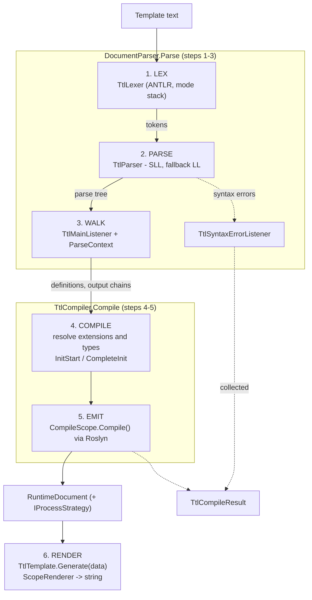
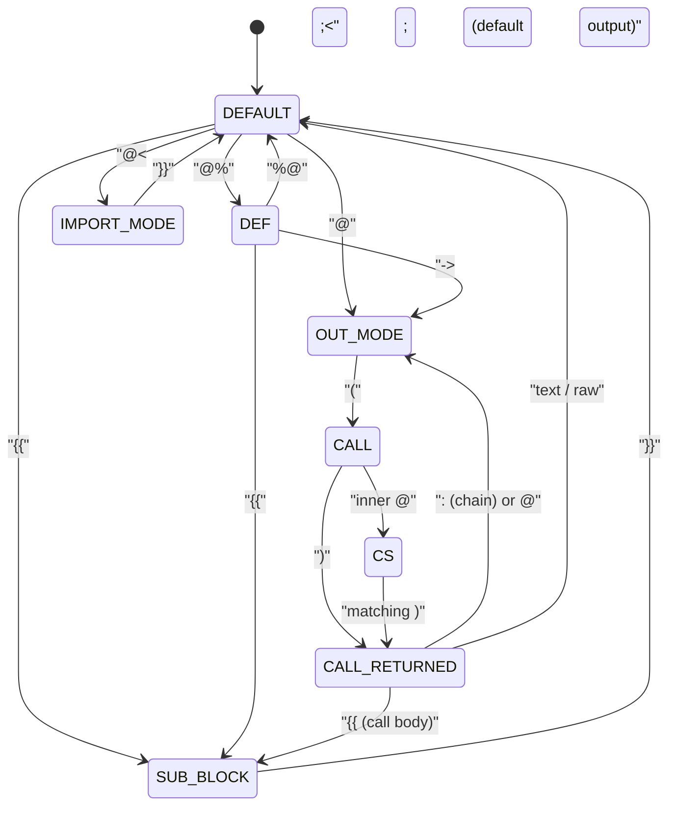

# Architecture

This page is for contributors who want to understand or modify the engine. It traces a
template from text to rendered output and points at the types that do each job.

## High‑level pipeline



The orchestration entry points are
[`DocumentParser.Parse`](../src/Templates/Language/DocumentParser.cs) (steps 1–3) and
[`TtlTemplate.Compile`](../src/Templates/TtlTemplate.cs) → `TtlCompiler.Compile` (steps 4–5).

---

## 1. Lexing

The lexer is generated from [TtlLexer.g4](../src/Templates.Language/TtlLexer.g4) (which
imports [CSharp.g4](../src/Templates.Language/CSharp.g4) for C# tokens). It is **mode‑based**:
a stack of lexer modes makes the language context‑sensitive so that the same characters mean
different things in different places (e.g. `}}` ends a subtemplate but is plain text at the
top level).

Modes (entered/exited via `pushMode`/`popMode`/`mode`):

| Mode | Entered by | Purpose |
| --- | --- | --- |
| *(default)* | — | Top‑level text + directive starts (`@%`, `@<<`, `@`, raw). |
| `SUB_BLOCK` | `{{` | Subtemplate body; `}}` pops. |
| `DEF` | `@%` | Definition block: `<name>`, `:` base, `::` type, `->` default, `%@` pops. |
| `IMPORT_MODE` | `@<<` | Import path between `{{ }}`. |
| `OUT_MODE` | `@` | Extension name; `(` opens parameter. |
| `CALL` | `(` | Parameter tokens (ids, `.`, `::`, `:`), nested `(`; inner `@` → `CS`. |
| `CALL_RETURNED` | `)` | What follows a call: `:` chain, `@` next, `{{` body, raw, etc. |
| `CS` | inner `@` in a parameter | Embedded C# expression; balances `(`/`)`, ends at matching `)`. |

The mode transitions (solid = push, dashed = pop/return to a mode):



Comments (`@* … *@`), trimmed whitespace (`@\`), and definition whitespace are routed to the
**hidden channel** so they never reach the parser but are still available for tooling (the
listener collects hidden‑channel positions as `SkippedTokens`). This is why comments can
appear mid‑token. See the
[Language Reference → lexer modes](language-reference.md#how-the-lexer-reads-a-template-modes)
for the author‑facing view.

---

## 2. Parsing

The parser is generated from [TtlParser.g4](../src/Templates.Language/TtlParser.g4). The
top‑level rule is `ttl`; the interesting rules are `definition`, `outblock`, `chain`, `call`,
`member_expression`, `csharp_expression`, and `subtemplate`.

[`DocumentParser`](../src/Templates/Language/DocumentParser.cs) controls prediction strategy:

- It first parses in **SLL** mode (fast). If SLL throws `ParseCanceledException` (ambiguity),
  or if errors were reported, it **falls back** to `LL_EXACT_AMBIG_DETECTION` (full LL) via
  `ParseDiagnosticMode`, and records a `TtlCompileWarning` noting the SLL failure.
- When `TemplateOptions.ProvideLanguageFeatures` is set (editor/tooling mode), it parses
  directly in LL mode and produces a token list for syntax highlighting instead of optimizing
  for throughput.

Syntax errors are gathered by
[`TtlSyntaxErrorListener`](../src/Templates/Language/TtlSyntaxErrorListener.cs) into the
`ParseContext`, then copied onto `CompileContext.CompileErrors`.

---

## 3. Tree walking

A `ParseTreeWalker` drives
[`TtlMainListener`](../src/Templates/Language/TtlMainListener.cs), which builds the
[`ParseContext`](../src/Templates/Language/ParseContext.cs): the set of **definitions**
(`DefinitionBlock`/`DefinitionItem`), **output chains** (`OutputChain`/`OutputItem`),
imports, and the raw/text spans. This is the structured representation the compiler consumes.

---

## 4–5. Compilation and code generation

[`TtlCompiler`](../src/Templates/Runtime/TtlCompiler.cs) turns the parse context into a
[`RuntimeDocument`](../src/Templates/Runtime/RuntimeDocument.cs):

- It instantiates the right **extension** for each call (resolved by name from the registered
  set), and calls `InitStart` to thread types through the chain and compile nested
  subtemplates; extensions needing a second pass use `CompleteInit` (e.g.
  [`PartialExtension`](../src/Templates/Extensions/PartialExtension.cs)).
- **Embedded C# expressions** (`@( … )`) are emitted into C# source using the templates in
  [src/Templates/LanguageTemplates](../src/Templates/LanguageTemplates)
  (`CSharpPreparseTemplate.tcs`, `CSharpClassTemplate.tcs`, embedded as resources) and compiled
  by **Roslyn** (`Microsoft.CodeAnalysis.CSharp`). The
  [`CompileScope`](../src/Templates/Runtime)/`CSharpContext` track imported namespaces
  (`@using`) and the model type (`@model`, `:: Type`).
- `CompileScope.Compile()` performs the actual Roslyn compilation. Errors are collected as
  `TtlCompileError`s rather than thrown, and surfaced through
  [`TtlCompileResult`](../src/Templates/Data/TtlCompileResult.cs).

The result is a `RuntimeDocument` exposing an `IProcessStrategy` (`Strategy`) — the compiled
render plan.

---

## 6. Rendering

[`TtlTemplate.Generate`](../src/Templates/TtlTemplate.cs) creates a
[`ScopeRenderer`](../src/Templates/Data) and a root [`Scope`](../src/Templates/Data/Scope.cs),
then invokes `_processStrategy.Render(scope)`. Extensions write through
`scope.Renderer.Render(...)` (the streaming path, `RenderData`) or return strings
(`ProcessData`) when a parent needs the value (e.g. inside a chain). The renderer's buffer is
size‑adaptive across calls (a per‑instance high‑water mark with ~10 % margin; the field is
length‑based on net8+ and count‑based on older targets).

`Scope` is a small readonly struct carrying `ModelData`, `ChainedData`, `ParentModelData`,
`CallerData`, `RootData`, and the `Renderer`; its pure transforms (`Model`, `Parent`, `Chain`,
…) construct the child scopes extensions hand to their subtemplates. See
[Writing Custom Extensions](custom-extensions.md) for the author‑facing contract.

---

## Source layout (`src/`)

| Path | Contents |
| --- | --- |
| [src/Templates](../src/Templates) | Core engine. |
| `Templates/Core` | Extension base classes, `IExtension`, `InitContext`. |
| `Templates/Extensions` | The 19 built‑in extensions. |
| `Templates/Language` | Parser host: `DocumentParser`, `TtlMainListener`, `ParseContext`, `OutputItem`, `DefinitionItem`, `CallParameter`. |
| `Templates/Runtime` | `TtlCompiler`, `RuntimeDocument`, `CompileContext`, `CompileScope`, `IExtension`, `TemplateResolver`. |
| `Templates/Data` | `Scope`, `TemplateOptions`, `TtlCompileResult`, `ExType`, render types. |
| `Templates/Attributes` | The extension/model attributes. |
| `Templates/Strings` | Fast string building (`ExStringBuilder`, `LinearList`). |
| `Templates/LanguageTemplates` | `.tcs` resources used to emit C# for Roslyn. |
| [src/Templates.Language](../src/Templates.Language) | ANTLR grammar + generated lexer/parser + editor assets. |
| [src/Templates.Mvc](../src/Templates.Mvc) | ASP.NET Core MVC view engine. |
| [src/Templates.Tests](../src/Templates.Tests) | xUnit tests + `.thtml` fixtures. |
| [src/Templates.Performance](../src/Templates.Performance) | BenchmarkDotNet benchmarks. |

---

## The grammar and generated code

The grammar lives in [src/Templates.Language](../src/Templates.Language):

- [TtlLexer.g4](../src/Templates.Language/TtlLexer.g4) — lexer (modes, tokens).
- [TtlParser.g4](../src/Templates.Language/TtlParser.g4) — parser rules.
- [CSharp.g4](../src/Templates.Language/CSharp.g4) — C# token fragments imported by the lexer.

Generated C# (checked in under `generated/`) is produced by ANTLR 4.13.1. To regenerate after
editing the `.g4` files, run [generate_cs.cmd](../src/Templates.Language/generate_cs.cmd)
(requires Java and the ANTLR jar at `lib/antlr-4.13.1-complete.jar`):

```
java -jar "..\..\lib\antlr-4.13.1-complete.jar" -Dlanguage=CSharp "TtlLexer.g4" "TtlParser.g4" -o "generated" -lib "generated" -package Templates.Language
```

The project references `Antlr4.Runtime.Standard` 4.13.1 at run time. The `js/` and
`ace_build/` directories are excluded from the C# compile
([Templates.Language.csproj](../src/Templates.Language/Templates.Language.csproj)).

---

## Editor / tooling integrations

- **JavaScript parser** — `generate_js.cmd` produces a JS lexer/parser under `js/` from the
  same grammar (for in‑browser editing).
- **Ace editor** — `ace_build/` and `build_ace.sh` build an
  [Ace](https://ace.c9.io/) mode using the JS parser for syntax highlighting on the web.
- **Visual Studio extension** — [integrations/Templates.Editor](../integrations/Templates.Editor)
  provides classification (highlighting), error tagging, and IntelliSense (completion / quick
  info) for `.thtml` files. The tooling path is enabled by
  `TemplateOptions.ProvideLanguageFeatures`, which makes `DocumentParser` emit a token list.

For build/test/packaging mechanics, continue to [Building & Testing](building.md).
