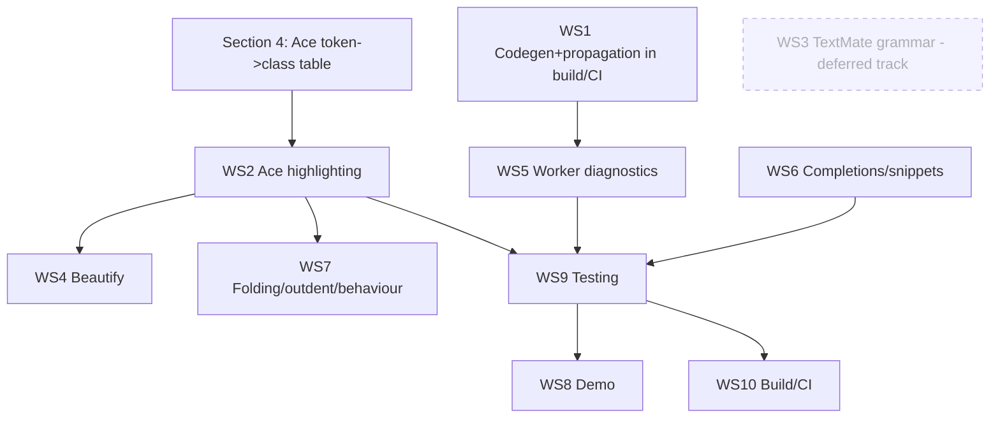

# Ace editor v2 migration plan

Actionable plan to bring the **Ace web editor** up to the **v2 language migration** that
has already landed in the C# engine and the ANTLR grammar. **Ace is the primary target
of this plan.** Nothing in this document is implemented yet — it is the execution plan
only.

> Scope note. The v2 grammar/engine changes are **already merged** (verified:
> [HeddleLexer.g4](../../src/Heddle.Language/HeddleLexer.g4),
> [HeddleParser.g4](../../src/Heddle.Language/HeddleParser.g4),
> `Heddle/Extensions/ElifExtension.cs`, `ProfileExtension.cs`,
> `Runtime/Expressions/NativeExpressionCompiler.cs`, `OutputProfile`,
> `TrimDirectiveLines`). The editor-facing artifacts were **not** carried along. This
> plan closes that gap.

## 0. Decisions applied (2026-07-08)

These maintainer decisions resolve the open questions in
[ace-v2-migration-gaps.md](ace-v2-migration-gaps.md) and shape the workstreams below:

- **D-A — Multi-mode tokenizer already extended.** The Ace tokenizer/classifier has been
  extended to support multiple modes safely, so the earlier "stateless regex" concerns
  (the four `:` roles, function-call lookahead, `heddle-def-props` entry/exit) are **no
  longer risks** — classification is done per-mode. WS2 targets classification coverage,
  not tokenizer plumbing.
- **D-B — Ace-first, no pixel parity.** Success = **every v2 token is recognized and
  properly classified in Ace.** Exact visual/pixel parity with VS Code is **not** a goal.
  The VS Code TextMate grammar is handled on a **separate track** (see WS3, now deferred);
  gaps there are addressed later.
- **D-C — Keep the Ace pin.** `build_ace.sh` stays pinned to Ace `v1.32.6`. An Ace upgrade
  is deferred to a later effort; do not change the pin now.
- **D-D — Code generation is part of the build, CI-enforced.** JS grammar generation runs
  in the build and CI **fails** if the checked-in generated/propagated files are stale.
  This can make a local build fail until the developer regenerates locally — an accepted
  trade-off. At the current state regeneration produces **no diff**, so this only locks in
  CI enforcement against future drift.

---

## 1. Why this is needed (current state)

| Artifact | Path | State | Gap |
| --- | --- | --- | --- |
| ANTLR **JS** lexer/parser | root [js/HeddleLexer.js](../../src/Heddle.Language/js/HeddleLexer.js) vs mode copy [js/src/mode/heddle/HeddleLexer.js](../../src/Heddle.Language/js/src/mode/heddle/HeddleLexer.js) | Root output **already v2** (has v2 tokens + `DEF_PROPS`); the **mode copy** the bundle consumes is stale 1.x (`symbolicNames` stops at `CALL_WS`) | Generation not propagated to the mode copy and not build/CI-enforced. Worker rejects valid v2 templates. |
| Highlight rules | [js/src/mode/heddle_highlight_rules.js](../../src/Heddle.Language/js/src/mode/heddle_highlight_rules.js) | 1.x — `heddle-call` state only knows `ID`, `.`, `:`, `::`, parens, `@`→C# | No native-expression operators/literals/`this`/`[]`/`,`/function calls; no prop list, named args, slot `out::`; no `@elif`/`@else`/`@raw`/`@profile`. |
| Beautify / formatter | [js/src/ext/beautify.js](../../src/Heddle.Language/js/src/ext/beautify.js) | Generic Ace HTML beautifier keyed on C#/JS keywords (`if\|else\|elseif\|for…`) + paren depth | Unaware of `@`-directives, `@elif`/`@else` chaining, native-expression spacing, prop/named-arg comma layout. |
| Worker diagnostics | [js/src/mode/heddle_worker.js](../../src/Heddle.Language/js/src/mode/heddle_worker.js) + [HeddleErrorListener.js](../../src/Heddle.Language/js/src/mode/heddle/HeddleErrorListener.js) | Surfaces raw ANTLR parse messages only | No semantic `HEDxxxx` diagnostics (HED2xxx–HED5xxx); message text does not match the engine. |
| Static completer | [js/src/mode/heddle_completions.js](../../src/Heddle.Language/js/src/mode/heddle_completions.js) | Word list missing `elif`/`elseif`/`else`, `profile`, `raw`, slot `out`, native functions | Completions omit new extensions & functions. |
| Snippets | [js/src/snippets/heddle.snippets.js](../../src/Heddle.Language/js/src/snippets/heddle.snippets.js) | Only `list`, `if`, `ifnot` | No `elif`/`else`, `for` (typed), `param`, prop-declaration, slot snippets. |
| Folding / outdent / behaviour | [js/src/mode/folding/heddle.js](../../src/Heddle.Language/js/src/mode/folding/heddle.js), `heddle_brace_outdent.js`, `mode/behaviour/heddle.js` | Keyed on 1.x paren/keyword token classes | May need new bracket pairs (`[ ]`) and prop-list handling. |
| VS Code TextMate grammar *(deferred track)* | [docs/coloring-scheme/heddle.tmLanguage.json](../../docs/coloring-scheme/heddle.tmLanguage.json) (single source; copied to `editors/vscode/syntaxes/` by [copy-grammar.js](../../editors/vscode/build/copy-grammar.js)) | 1.x — "mirrors the Ace highlighter" | Same coloring gaps, but **handled separately** (WS3); VS Code semantics already come from the LSP. |

### VS Code vs Ace — different exposure

- **VS Code** already gets *typed* completion, live diagnostics, hover, and semantic
  coloring from the **LSP** (`Heddle.LanguageServices`), which runs the real v2 engine.
  Its only 1.x artifact is the **TextMate grammar** (the fallback/textual coloring layer).
  Per **D-B** this is a **separate, deferred track** (WS3) — not part of the Ace effort.
- **Ace** (this plan's focus) has **no LSP**. It relies entirely on the hand-written
  highlight rules, the JS-ANTLR worker, a static word-list completer, snippets, and the
  generic beautifier. Per **D-A** the tokenizer already supports multiple modes safely,
  so the remaining work is classification coverage plus the surrounding artifacts below.

---

## 2. Goals & success criteria

1. **Every v2 construct is recognized and correctly classified in Ace** (per the §4
   table). This — not pixel parity with VS Code — is the primary success bar (**D-B**).
2. The Ace worker **accepts** all valid v2 templates and reports syntax errors at correct
   positions (required baseline); v2 semantic diagnostics are an explicit stretch (WS5).
3. `beautify` produces stable, idempotent formatting for v2 directives and expressions.
4. Completions and snippets cover the v2 extension/function/prop surface.
5. JS grammar generation is **wired into the build and enforced in CI** so the editor
   grammar can never silently fall behind the `.g4` again (**D-D**).

The VS Code TextMate grammar is out of this plan's success bar and tracked separately
(WS3, deferred).

---

## 3. Pipeline recap (where things live & how they build)

- **JS grammar generation:** [generate_js.cmd](../../src/Heddle.Language/generate_js.cmd)
  runs ANTLR 4.13.1 (`-Dlanguage=JavaScript`) over the v2 `.g4` files, output to `js/`.
  **Finding:** the root `js/HeddleLexer.js` is **already regenerated to v2** (has the v2
  tokens + `DEF_PROPS`); the stale artifact is the **copy** at `js/src/mode/heddle/` that
  the mode consumes. So the real task is **generation + propagation wired into the build**
  (**D-D**), not a from-scratch regen (see WS1).
- **Ace bundle:** [build_ace.sh](../../src/Heddle.Language/build_ace.sh) clones Ace
  `v1.32.6` (**pin kept — D-C**), copies `js/src/` into it, bundles the ANTLR4 JS runtime,
  and builds via `Makefile.dryice.js`. Output is staged by
  [.github/workflows/docs.yml](../../.github/workflows/docs.yml) into `docs/public/ace/`
  (gitignored — never committed; only `demo.html` is tracked).
- **VS Code grammar:** single source `docs/coloring-scheme/heddle.tmLanguage.json`,
  copied into `editors/vscode/syntaxes/` by `editors/vscode/build/copy-grammar.js`
  (the copy is never hand-edited).
- **WASM demo (optional typed path):** phase-9 wires phase-6's `HeddleLanguageService`
  compiled to WASM and talks to Ace over a `postMessage` protocol
  ([wasm-demo.md](spec/phase-9-demo-and-integration/wasm-demo.md)) for *typed* completion
  and diagnostics — a route to give the demo Ace instance real engine features.

All new source edits happen under `src/Heddle.Language/js/src/**` and the single grammar
source; build outputs are regenerated, never edited.

---

## 4. The token → class mapping (Ace source of truth)

The Ace highlighter must classify every v2 token as below. This table is the **Ace**
source of truth (built from the spec's editor-token classification:
[phase-1 grammar](spec/phase-1-native-expressions/grammar.md#editor-token-classification),
[phase-5 grammar](spec/phase-5-props-and-slots/grammar.md#editor-token-classification)).
The TextMate column is retained only as reference for the deferred VS Code track (WS3) —
it is not a success gate for this plan (**D-B**).

| v2 construct | Example | ANTLR token(s) | `HeddleTokenType` | Ace token class (suggested) | TextMate scope (suggested) |
| --- | --- | --- | --- | --- | --- |
| Boolean/null literal | `true` `false` `null` | `TRUE`/`FALSE`/`NULL` | `Literal` | `constant.language` | `constant.language.heddle` |
| Integer / real literal | `42` `1.5f` `0xFF` | `INT_LIT`/`REAL_LIT` | `Literal` | `constant.numeric` | `constant.numeric.heddle` |
| String literal | `"hi"` | `STRING_LIT` | `Literal` | `string.quoted.double` | `string.quoted.double.heddle` |
| Char literal | `'x'` | `CHAR_LIT` | `Literal` | `string.quoted.single` | `string.quoted.single.heddle` |
| Binary/unary operators | `+ - * / % && \|\| == != < > <= >= << >> & \| ^ ~ ! ?? ? :` | `OP_*`, ternary `OP_QUESTION`/`DELIM` | `Operator` | `keyword.operator` | `keyword.operator.heddle` |
| Indexers / grouping brackets | `a[0]` | `LBRACKET`/`RBRACKET` | `Operator` | `keyword.operator` (or `paren`) | `punctuation.section.brackets.heddle` |
| Argument/element comma | `f(a, b)` | `COMMA` | `Operator` | `punctuation.operator` | `punctuation.separator.heddle` |
| Function call name | `range(1,10)` | `ID` (FunctionCallExpr) | `FunctionName` | `support.function` | `support.function.heddle` |
| Method call name | `x.Trim()` | `ID` (MethodCallExpr) | `FunctionName` | `support.function` | `support.function.heddle` |
| `this` keyword | `this.Name` | `THIS` | `Literal` | `variable.language` | `variable.language.this.heddle` |
| Prop-list open/close | `<card( … )>` | `OUT_PARAMSTART`/`OUT_PARAMEND` (in `DEF_PROPS`) | `OutParamStart`/`OutParamEnd` | `keyword.operator.paren` | `punctuation.section.parens.heddle` |
| Prop name / type | `style: string` | `ID`/`ID` | `Id` | `variable.parameter` / `storage.type` | `variable.parameter.heddle` / `storage.type.heddle` |
| Prop default `=` | `= "plain"` | `ASSIGN` | `Operator` | `keyword.operator` | `keyword.operator.assignment.heddle` |
| Named argument name+`:` | `title: X` | `ID` + `DELIM` | `Id` + `Delim` | `variable.parameter` + `punctuation.operator` | `variable.parameter.heddle` + `punctuation.separator.heddle` |
| Slot param `out::` Type | `out:: string` | `ID` + `DEF_TYPE` | `Id` + `DefType` | `keyword` + `keyword.operator` | `keyword.other.slot.heddle` + `keyword.operator.type.heddle` |
| `@elif` / `@elseif` | `@elif(x){{…}}` | (directive text) | — | `keyword` / `support.function` | `keyword.control.heddle` |
| `@else` | `@else{{…}}` | (directive text) | — | `keyword` | `keyword.control.heddle` |
| `@raw` | `@raw(x)` | (directive text) | — | `support.function` | `support.function.heddle` |
| `@profile` | `@profile(html){{…}}` | (directive text) | — | `support.function` | `support.function.heddle` |

> Keyword-literal and `ID` tokens include their **trailing whitespace** in the span
> (the `WS*` / `SINGLE_LINE_WS*` in the lexer rules). The highlighter must tolerate the
> trailing space inside the token match, matching how `ID` is already reported.

Finalize the **Ace class** column first; it drives WS2. The TextMate column is advisory
for the deferred WS3 track.

---

## 5. Workstreams

### Execution loop (run until done)

This plan is built to run as an **iterative loop**: take the next workstream in the §6
order, implement it, run *its* verification, and repeat until every workstream's
**Definition of Done** (§7) is green and the global gate passes. §8 lists the exact files
each workstream touches and the harness/command that verifies it.

**Per-iteration cycle:**

1. **Select** the next not-done workstream, respecting the §6 dependencies.
2. **Implement** only that workstream's changes under `src/Heddle.Language/js/src/**`
   (and, for WS1/WS10, the build/CI wiring). Never hand-edit generated files or bundle
   outputs.
3. **Regenerate + build:**
   - run the codegen step (`src/Heddle.Language/generate_js.cmd`, or the wired build
     target) to refresh the JS grammar **and** propagate it into `js/src/mode/heddle/`;
   - run `bash src/Heddle.Language/build_ace.sh` to produce the Ace bundle.
4. **Verify** against that workstream's §7 DoD row using the §8 harness/command.
5. **Iterate** on failures — do not advance until the row is green.
6. **Global gate (before declaring the plan done):** run the full C# suite
   (`dotnet test`), the Ace token/beautify/completion harness (WS9), the docs smoke
   (`npm --prefix docs run demo:smoke`), and the CI no-diff codegen check (**D-D**).

> A JS-side test harness for the tokenizer/highlighter, beautify, and completions does
> **not exist yet** (`src/Heddle.Language/package.json` has only a placeholder `test`
> script). Standing it up is the first task of **WS9** and a prerequisite for closing
> WS2/WS4/WS6. Until it exists, those workstreams cannot be verified in the loop.

### WS1 — Generate + propagate the JS ANTLR grammar, wired into the build (**D-D**)

> Refined premise: the root `js/HeddleLexer.js` is **already** v2; the stale artifact is
> the copy under `js/src/mode/heddle/` that the mode/bundle consume. The task is to make
> generation **and** propagation a build step and enforce it in CI — not a one-off regen.

1. **Generation step.** Make [generate_js.cmd](../../src/Heddle.Language/generate_js.cmd)
   (ANTLR 4.13.1) a build step so `js/HeddleLexer.js`/`HeddleParser.js` are regenerated
   from the v2 `.g4`. Verify `symbolicNames`/`modeNames` include the phase-1 & phase-5
   additions (`TRUE`, `FALSE`, `NULL`, `INT_LIT`, `REAL_LIT`, `STRING_LIT`, `CHAR_LIT`,
   all `OP_*`, `LBRACKET`, `RBRACKET`, `COMMA`, `THIS`, `ASSIGN`, and the `DEF_PROPS` mode).
2. **Propagation step.** Add a deterministic copy from the generated `js/*.js` into
   `js/src/mode/heddle/` (the location the mode consumes and `build_ace.sh` bundles),
   **excluding** the hand-written wrappers (`HeddleLexerExtended.js`,
   `HeddleParserExtended.js`, `HeddleTokenizer.js`, `HeddleParserListener.js`). Fold this
   copy into the generation step so the two never diverge again.
3. **Wrapper sync.** Confirm the hand-written wrappers still compile against the new
   generated rule/context names (`native_expression`, `def_props`, `def_prop_item`,
   expression alternatives). Update only if a wrapper references a renamed context.
4. **CI enforcement (the drift guard).** In CI, run the generation+propagation step and
   **fail if it produces a diff** against the checked-in files (`git diff --exit-code` over
   `js/` and `js/src/mode/heddle/`). This is the single mechanism that prevents future
   drift — it supersedes a separate ad-hoc guard. Document that local builds may fail
   until the developer regenerates locally (accepted per **D-D**); at the current state
   the step yields no diff.

**Exit:** the generation+propagation build step is idempotent (no diff on a clean tree),
CI enforces it, and the JS worker parses every positive corpus row from
`NativeExpressionParseTests` and `PropsParseTests` without spurious errors.

### WS2 — Ace syntax highlighting (`heddle_highlight_rules.js`)

> Per **D-A**, the tokenizer already supports multiple modes safely, so mode entry/exit,
> the four `:` roles, and function-call classification are handled **per-mode** — not by
> fragile single-state regex. This workstream is about **classification coverage**: adding
> the v2 tokens to the appropriate modes and mapping them to the §4 Ace classes.

1. **Native expressions (`heddle-call` / expression mode).** Classify: string (`"…"` with
   escapes), char (`'…'`), real then int literals, `true/false/null`, `this`, the operator
   set (`?? && || == != <= >= << >>` before `? & | < > = ! + - * / % ^ ~`), `[` `]`, `,`,
   and function/method-call names (`ID` at call position → `support.function`, resolved via
   the tokenizer's mode context). Preserve the existing `@`→`cs-` C# escape, `::`, `:`,
   `.`, and `ID` member paths. Map each to the §4 Ace class.
2. **Prop-declaration mode (`DEF_PROPS`).** Classify the prop list opened by `(` after a
   definition name: prop `name`, `:` delim, type `ID` (reuse the generic-type handling),
   `=` default, literals, `,`, and the closing `)`. The multi-mode tokenizer keeps this
   isolated from the `<name : base>` header, so the two `:` uses don't collide.
3. **Named arguments.** `name:` at argument position → `variable.parameter` +
   `punctuation.operator`; the ternary `:` (after `OP_QUESTION`) stays `keyword.operator`.
   Disambiguation is by mode/context, not lookahead.
4. **Slot parameter** `out:: Type`: `out` → keyword, `::` → type operator.
5. **Directives** `@elif`, `@elseif`, `@else`, `@raw`, `@profile`: classify as control
   keywords / functions in the entry mode rather than plain output identifiers.
6. Add regression fixtures (WS9) for each construct and nested combinations (expression
   inside `@if(...)`, prop default expressions, `@out(this.X)`).

### WS3 — VS Code TextMate grammar parity *(deferred — separate track, D-B)*

> Not part of this plan's success bar. Tracked separately and addressed later if gaps are
> found in VS Code. The §4 Ace classes remain the reference the future grammar work maps
> from. Captured here only so the dependency is visible.

1. Edit the **single source** `docs/coloring-scheme/heddle.tmLanguage.json`; the
   `editors/vscode/syntaxes/` copy is regenerated by `copy-grammar.js`.
2. Add patterns for the v2 constructs (literals/operators/brackets/commas/function names/
   `this`; prop list; named arguments; slot `out::`; `@elif`/`@elseif`/`@else`/`@raw`/
   `@profile`), mapping from the §4 table.
3. Audit the existing `"comment": "Ace: …"` cross-references for staleness while doing so.
4. Verify with the VS Code scope inspector. (VS Code also gets correct semantics from the
   LSP regardless, so this is coloring-only.)

### WS4 — Beautify / formatter (`ext/beautify.js`)

1. Recognize Heddle `@`-directive control flow: treat `@if`/`@ifnot`/`@for`/`@elif`/
   `@elseif`/`@else` blocks the way the current code treats `if/else/elseif/for`
   (space-before `@elif`/`@else` after a closing `}}`, indent the body).
2. Handle native-expression spacing inside `@(...)`: normalize single spaces around binary
   operators, no space after unary/`!`/`~`, no space before `,` and one after, no space
   inside `[` `]` indexers — **idempotently** (running twice = no change).
3. Handle prop-declaration and named-argument lists: consistent `name: type = default`
   spacing and comma layout; optional line breaks for long lists via `formatOptions`.
   Define the Heddle-specific option schema explicitly, e.g.
   `{ maxLineLength: 100, breakLongPropLists: true, lineBreaksAfterCommasInCurlyBlock: true }`,
   stored on `exports.formatOptions` (extend the existing object) and read by `beautify`;
   options are read fresh each invocation so formatting stays deterministic.
4. Do not reflow text/HTML outside directives; preserve `@*…*@` comments and string
   literals verbatim.
5. Add before/after golden fixtures asserting idempotency (WS9).

### WS5 — Worker diagnostics / error messages

Decision: **parse-only is the required baseline; semantic diagnostics are an explicit
stretch** (resolves gaps 6–7).

- **Required baseline (parse errors).** With WS1 done, the JS-ANTLR worker positions
  `HED0003`-class syntax errors correctly. Align the message strings emitted through
  `HeddleErrorListener` / `heddle_worker.js` with the engine's phrasing where feasible.
  This satisfies the plan's diagnostics goal on its own.
- **Stretch (semantic diagnostics).** To surface HED2xxx–HED5xxx (XSS, branching, props,
  ergonomics), route diagnostics through the WASM `HeddleLanguageService` (the phase-9
  `postMessage` protocol, which already exists) into `session.setAnnotations`, giving Ace
  the diagnostic set VS Code gets from the LSP. **Reuse** the existing demo WASM worker
  rather than instantiating a second engine; gate behind WASM availability and fall back
  to the parse-only baseline when absent. Only pursue after the baseline ships.

### WS6 — Completions (`heddle_completions.js`) & snippets (`heddle.snippets.js`)

1. Extend `defaultExtensions` with `elif`, `elseif`, `else`, `profile`, `raw`, slot `out`,
   and keep `if`/`ifnot`/`for`/`param`/`import`/`using`/`partial`.
2. Add native-expression **function** completions. **Baseline:** hard-code the
   `FunctionRegistry` defaults (e.g. `range`, `upper`, `lower`, `trim`, `len`, `contains`,
   `format`, …) in the static list and add a code comment noting the maintenance coupling
   (adding a C# built-in requires updating this list). **Stretch:** if the WASM path (WS5
   stretch) ships, query the registry through it so the list is engine-sourced.
3. New snippets: `elif`, `else`, typed `for`, `param`, a prop-declaration header
   (`<name(prop: type = default)> {{ }}`), and a slot form (`out:: Type` + `@out(…)`).
4. If the WASM typed path (WS5 stretch) is wired, prefer LSP/engine-backed completion over
   the static word list in the demo, keeping the word list as the offline fallback (per
   phase-9 D7: the upgrade is *word-list → typed*, not *nothing → typed*).

### WS7 — Folding / outdent / behaviour

1. `folding/heddle.js`: confirm `{{`/`}}` and `@%`/`%@` fold widgets still pair after the
   new tokens; add prop-list `(`/`)` folding if header folding is desired.
2. `heddle_brace_outdent.js` and `mode/behaviour/heddle.js`: add `[` `]` to bracket pairs
   and ensure auto-close/skip works inside native expressions and prop lists. The
   multi-mode tokenizer (**D-A**) already prevents interference with `<` `>` in generic
   types, so this is a matter of registering the new pairs, not disambiguation.

### WS8 — Demo alignment (optional, parity-boosting)

1. Update [docs/public/demo.html](../../docs/public/demo.html) starter template to show a
   v2 construct (native expression, `@if/@elif/@else`, a prop-based component) so the
   coloring and (if WS5 stretch) diagnostics are demonstrable.
2. If the WASM `HeddleLanguageService` path is adopted, verify the Playwright smoke suite
   scenarios (fallback / typed / completion / render / C#-declined) still pass.

### WS9 — Testing & verification

0. **Stand up the JS harness (prerequisite for WS2/WS4/WS6 verification).** There is no
   JS test runner today — add one under `src/Heddle.Language/js` (a `test` script in
   [package.json](../../src/Heddle.Language/package.json) plus a lightweight runner) that
   loads the mode's `getTokenizer()` and exercises the artifacts below. Wire it into CI.
1. **Highlight fixtures:** token-stream snapshots for each §4 construct and nested cases;
   assert the expected **Ace class** per token.
2. **Worker parse fixtures:** mirror the positive rows of `NativeExpressionParseTests` and
   `PropsParseTests` and assert zero spurious annotations; mirror the *error* rows and
   assert a positioned error.
3. **Beautify goldens:** before/after pairs + idempotency (format twice == once).
4. **Completions/snippets:** assert the new entries are offered in the right modes.
5. **Coverage check (not pixel parity, D-B):** verify every v2 token in a construct-complete
   sample receives a defined, non-default Ace class — the success bar is complete, correct
   classification, not visual matching with VS Code.

### WS10 — Build / CI wiring

1. **Codegen in build + CI (D-D).** The JS grammar generation+propagation step (WS1) runs
   in the build and CI **fails on any diff** — this *is* the drift guard; no separate
   ad-hoc check is needed. Document the local-regeneration expectation.
2. Confirm `build_ace.sh` (pin kept at `v1.32.6` — **D-C**) picks up all edited
   `js/src/**` files and the docs workflow stages them into `docs/public/ace/`.
3. VS Code grammar shipping (`copy-grammar.js`) belongs to the deferred WS3 track, not
   this effort.

---

## 6. Sequencing & dependencies

Recommended order: **§4 table → WS1 → WS2 → WS4/WS6/WS7 → WS5 → WS9 → WS8/WS10.**
WS1 and the §4 table are the two hard prerequisites; everything else fans out from them.
WS3 (VS Code) runs on its own track and does not gate this effort.

---

## 7. Success criteria (Definition of Done)

The plan is **done** when every workstream row below is green **and** all global gates
pass. Each row is written as an objective, loop-checkable condition.

### Per-workstream DoD

| WS | Definition of Done (verifiable) | How it is checked (see §8) |
| --- | --- | --- |
| **WS1** | Running codegen+propagation on a clean tree produces **no git diff**; the propagated `js/src/mode/heddle/HeddleLexer.js` `symbolicNames`/`modeNames` contain every phase-1/phase-5 token and `DEF_PROPS`; the JS worker parses the full positive corpus with zero spurious errors. | `git diff --exit-code` over `js/**`; grep token names; worker corpus harness |
| **WS2** | Every construct in the §4 table is classified to its correct **Ace class**; a coverage scan over a construct-complete sample finds **no** v2 token falling to a default/`text` class. | Ace tokenizer snapshot harness + coverage assertion |
| **WS3** *(deferred)* | Not gating this plan. Tracked separately; row exists only to preserve the dependency. | — |
| **WS4** | `beautify` output matches goldens and is **idempotent** (running twice == once) on v2 directives and expressions; `exports.formatOptions` schema is present and honored. | Beautify golden + idempotency harness |
| **WS5** | **Baseline:** positive corpus → zero annotations; negative corpus → positioned error at the right offset. **Stretch:** HED2xxx–HED5xxx surface via the reused WASM worker, with graceful fallback when WASM is absent. | Worker annotation harness; (stretch) WASM diagnostics smoke |
| **WS6** | New extensions (`elif`/`elseif`/`else`/`profile`/`raw`/slot `out`) and the hard-coded registry functions are offered in the correct modes; new snippets expand correctly. | Completion/snippet harness |
| **WS7** | `[` `]` auto-close/skip works inside expressions and prop lists; `{{`/`}}` and `@%`/`%@` folds still pair; no regression on `<`/`>` in generic types. | Behaviour/folding harness + manual smoke |
| **WS8** | `demo.html` shows v2 constructs colored; the Playwright demo-smoke suite passes. | `npm --prefix docs run demo:smoke` |
| **WS9** | A JS test harness exists, runs in CI, and covers highlight, beautify, completions, and worker fixtures. | Harness runs green in CI |
| **WS10** | Codegen+propagation is a build step; **CI fails on any diff**; `build_ace.sh` picks up all `js/src/**` edits and the docs workflow stages the bundle into `docs/public/ace/`. | CI job result; staged-bundle check |

### Global gates (must all pass before “done”)

- [ ] `dotnet test` (full suite, incl. `NativeExpressionParseTests`, `PropsParseTests`) green.
- [ ] WS9 JS harness green (highlight + beautify + completions + worker).
- [ ] `npm --prefix docs run demo:smoke` green.
- [ ] CI codegen no-diff check green (**D-D**); Ace pin still `v1.32.6` (**D-C**).
- [ ] Every §4 construct recognized and correctly classified in Ace (**D-B** — no pixel parity).
- [ ] *(Stretch, non-gating)* WASM-backed semantic diagnostics visible in Ace.
- [ ] *(Separate track, non-gating)* VS Code TextMate grammar updated (WS3).

---

## 8. Affected files & testing scope

Exhaustive list of what each workstream touches and how it is exercised. “New” marks files
to be created; everything else is edited. Generated/bundle outputs are never hand-edited.

| WS | Affected files / areas | Testing scope & harness | Command(s) |
| --- | --- | --- | --- |
| **WS1** | [generate_js.cmd](../../src/Heddle.Language/generate_js.cmd); build wiring (MSBuild target or npm script) **New**; generated `js/HeddleLexer.js`, `js/HeddleParser.js`; propagated `js/src/mode/heddle/HeddleLexer.js`, `HeddleParser.js`; CI job in [.github/workflows/docs.yml](../../.github/workflows/docs.yml) | No-diff codegen check; token-vocabulary presence; worker parse over the C# corpus mirrored as JS fixtures | codegen step, then `git diff --exit-code -- src/Heddle.Language/js` |
| **WS2** | [heddle_highlight_rules.js](../../src/Heddle.Language/js/src/mode/heddle_highlight_rules.js) (+ any mode config it reads) | Token-stream snapshots per §4 construct; coverage assertion that no v2 token → default class | WS9 harness (`npm --prefix src/Heddle.Language test` **New**) |
| **WS3** *(deferred)* | [docs/coloring-scheme/heddle.tmLanguage.json](../../docs/coloring-scheme/heddle.tmLanguage.json) (single source) → `editors/vscode/syntaxes/` via [copy-grammar.js](../../editors/vscode/build/copy-grammar.js) | VS Code scope-inspector check (separate track) | — |
| **WS4** | [ext/beautify.js](../../src/Heddle.Language/js/src/ext/beautify.js) | Before/after goldens **New**; idempotency (format twice) | WS9 harness |
| **WS5** | [heddle_worker.js](../../src/Heddle.Language/js/src/mode/heddle_worker.js), [HeddleErrorListener.js](../../src/Heddle.Language/js/src/mode/heddle/HeddleErrorListener.js); *(stretch)* [heddle-demo-worker.js](../../src/Heddle.Demo.Wasm/wwwroot/heddle-demo-worker.js) wiring | Positive/negative annotation fixtures **New**; *(stretch)* WASM diagnostics smoke | WS9 harness; *(stretch)* demo-smoke |
| **WS6** | [heddle_completions.js](../../src/Heddle.Language/js/src/mode/heddle_completions.js), [snippets/heddle.snippets.js](../../src/Heddle.Language/js/src/snippets/heddle.snippets.js) | Completion-offered-in-mode fixtures **New**; snippet-expansion fixtures | WS9 harness |
| **WS7** | [folding/heddle.js](../../src/Heddle.Language/js/src/mode/folding/heddle.js), [heddle_brace_outdent.js](../../src/Heddle.Language/js/src/mode/heddle_brace_outdent.js), [behaviour/heddle.js](../../src/Heddle.Language/js/src/mode/behaviour/heddle.js) | Bracket-pair auto-close/skip fixtures **New**; fold-pairing smoke | WS9 harness + manual |
| **WS8** | [docs/public/demo.html](../../docs/public/demo.html) (tracked), [docs/demo-smoke/demo.spec.ts](../../docs/demo-smoke/demo.spec.ts) | Playwright demo-smoke (fallback/typed/completion/render/C#-declined) | `npm --prefix docs run demo:smoke` |
| **WS9** | JS harness scaffold under `src/Heddle.Language/js/**` **New** (test runner + `test` script in [package.json](../../src/Heddle.Language/package.json)); shared fixtures **New** | Establishes the harness the other rows rely on; wired into CI | `npm --prefix src/Heddle.Language test` |
| **WS10** | Build target / npm script **New**; [.github/workflows/docs.yml](../../.github/workflows/docs.yml); [build_ace.sh](../../src/Heddle.Language/build_ace.sh) (pin unchanged) | CI no-diff codegen gate; staged-bundle presence in `docs/public/ace/` | CI run |

**Fixture source of truth.** JS worker/highlight fixtures mirror the C# executable
corpora ([NativeExpressionParseTests](../../src/Heddle.Tests) / `PropsParseTests`) so the
two front ends stay aligned; when a corpus row changes on the C# side, the mirrored JS
fixture is updated in the same change.

**Not touched (guardrails).** The C# engine, `.g4` grammar, generated C#, the Ace pin, and
the VS Code LSP are out of scope (see §9); edits are confined to `src/Heddle.Language/js/src/**`,
the build/CI wiring, and (deferred) the single TextMate grammar source.

---

## 9. Explicitly out of scope

- Replacing Ace with Monaco (rejected in [phase-9](spec/README.md); Ace stays for v1).
- **Upgrading the Ace pin** — `v1.32.6` is kept; an upgrade is a later, separate effort
  (**D-C**).
- Any change to the C# engine, `.g4` grammar, or generated C# (already v2).
- The VS Code **TextMate grammar** (WS3) and **LSP** features (already v2-correct via
  `Heddle.LanguageServices`) — handled on a separate track, not gated by this plan
  (**D-B**).
